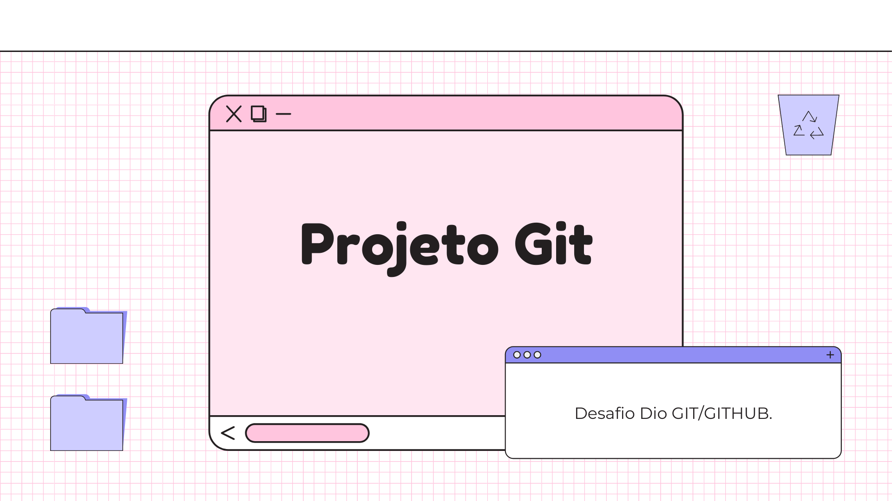

# Desafio-Git-github
Caderno de anotações de aprendizado

 ▫️ Projetos criados nesse caderno foram:

▫️ Pagina simples html e css. com fundo e foto.

▫️ Pagina de turismo com css responsivo adptado para estrutura de qualquer tela 

 ▫️ Clone netflix com formato jogos, uma lista de jogos com interação para paginas externas de jogos.
  lista de jogos infinitas, fundo com pelicula para melhor vizualização do úsuario e responsivo adptado para telas menores 

- **Links úteis**
- Markdown: https://www.markdownguide.org/getting-started/
- Personalizando seu perfil no GITHUB: https://www.youtube.com/watch?v=TsaLQAetPLU&t=876s
- Plataforma de ensino: https://web.digitalinnovation.one/

